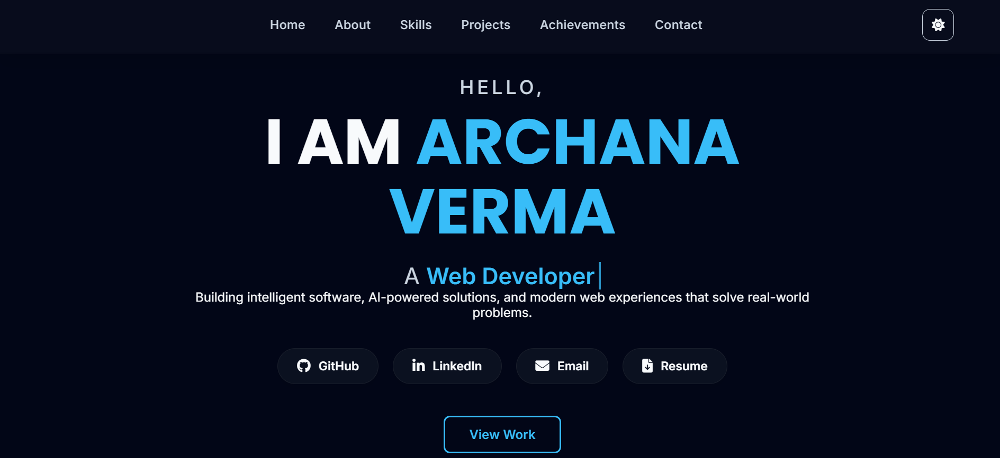

# 🌐 Personal Portfolio

A modern, responsive developer portfolio showcasing my projects, technical skills, hackathon achievements, internship experience, and resume.

## 🚀 Live Portfolio

🔗 https://archana7code.github.io/portfolio/

## 👩‍💻 About

I'm a B.Tech student specializing in Artificial Intelligence at IGDTUW with interests in:

- Full-Stack Web Development
- Backend Development
- Artificial Intelligence & Machine Learning
- Computer Vision
- Problem Solving

This portfolio highlights my technical journey through projects, hackathons, internship experience, and achievements.

---

## ✨ Features

- Responsive Design
- Light & Dark Theme
- Interactive UI & Animations
- Featured Projects
- Internship Experience
- Hackathon Achievements
- Resume Download
- Contact Section

---

## 🛠️ Tech Stack

### Frontend
- HTML5
- CSS3
- JavaScript

### Tools
- Git
- GitHub
- VS Code

---

## 📂 Featured Projects

### 🚦 Smart Traffic Signal Optimization System
- AI-assisted traffic signal prototype
- Ambulance priority detection
- Smart India Hackathon (College Level Selection)

### 🏙️ CivicFix
- ML-based civic issue detection platform
- Image classification using PyTorch
- Backend integration with Node.js & MongoDB

### 🤖 SkillPop
- AI-powered career assistant
- Resume analysis
- Learning roadmap generation
- AI chatbot & interview preparation

---

## 📸 Preview

---

## 📄 Resume

My latest resume is available directly from the portfolio website.

---

## 📬 Connect With Me

- LinkedIn: https://www.linkedin.com/in/archana-verma-287b3a328/
- GitHub: https://github.com/Archana7code
- Portfolio: https://archana7code.github.io/portfolio/

---

⭐ If you like this portfolio, consider giving the repository a star!